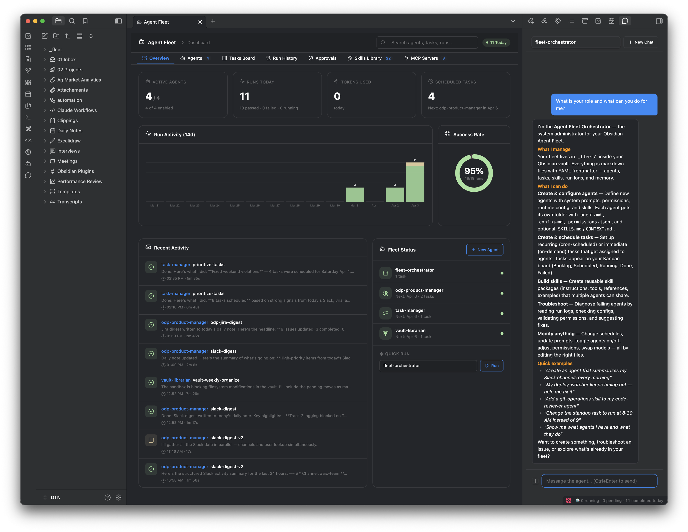

# Agent Fleet for Obsidian

**Turn Obsidian into an AI-powered command center. Create autonomous agents, schedule tasks, chat in real-time, connect via Slack, and hook into any MCP service — all from your vault.**



---

## What is Agent Fleet?

Agent Fleet is an Obsidian plugin that lets you build, configure, and run AI agents directly from your vault. Agents are powered by **Claude Code CLI** — works with a Claude Max/Pro subscription or Anthropic API key. Every agent, skill, task, and run log is a markdown file. If the plugin disappears, your knowledge stays.

### Core Capabilities

🤖 **AI Agents** — Create specialized agents with system prompts, skills, permissions, heartbeat schedules, and memory. Each agent is a folder of markdown files you fully own and control.

💬 **Interactive Chat** — Dock a chat panel anywhere in Obsidian. Switch between agents. Attach documents and images. Send follow-up messages while the agent works.

📡 **Slack Channels** — Chat with your agents from Slack. Multi-agent routing via `@agent-name` prefix. Native "is thinking..." indicator via Slack Assistants API. Session persistence across restarts.

💓 **Heartbeat** — Autonomous periodic agent runs. Define what an agent does when no one is asking — monitoring, reports, health checks — with results posted to Slack.

📋 **Task Board** — Kanban view with scheduling, priority, real-time progress tracking, and abort. Tasks run on cron schedules or on-demand.

🔌 **MCP Integration** — Discover, authenticate, and inspect MCP servers. One-click OAuth 2.1 authentication. Assign MCP tools to specific agents.

🧠 **Agent Memory** — Agents persist context across sessions using `[REMEMBER]` tags stored as markdown.

📊 **Dashboard** — Overview with run charts, success rates, token/cost tracking, activity timeline, fleet status, and streaming output from active agents.

---

## Quick Start

### Install

**Via npm (recommended):**
```bash
npm install -g obsidian-agent-fleet
```
The installer automatically finds your Obsidian vaults and copies the plugin files.

**Via BRAT:**
1. Install the [BRAT plugin](https://github.com/TfTHacker/obsidian42-brat)
2. Add beta plugin: `denberek/obsidian-agent-fleet`
3. Enable Agent Fleet in Settings → Community Plugins

**Manual:**
1. Download `main.js`, `manifest.json`, `styles.css` from the [latest release](https://github.com/denberek/obsidian-agent-fleet/releases)
2. Create `<vault>/.obsidian/plugins/agent-fleet/`
3. Copy the 3 files into that folder
4. Restart Obsidian → Enable Agent Fleet

### Requirements

- **Obsidian** 1.6.0+ (desktop only)
- **[Claude Code CLI](https://docs.anthropic.com/en/docs/claude-code)** — the engine behind all agent execution:
  ```bash
  npm install -g @anthropic-ai/claude-code
  claude  # authenticate on first run
  ```
- **Claude subscription** (Max or Pro) or **Anthropic API key** — Claude Code works with your existing subscription, no separate API costs. If you're already paying for Claude, you're ready to go.

### First Launch

On first launch, Agent Fleet creates a `_fleet/` folder in your vault:

```
_fleet/
├── agents/
│   └── fleet-orchestrator/    ← default agent (manages the fleet)
├── skills/                    ← 18 built-in skills
├── tasks/
├── channels/
├── runs/
└── memory/
```

The **Fleet Orchestrator** agent is ready — click Chat to ask it to create new agents, tasks, skills, or channels.

### Update

```bash
npm update -g obsidian-agent-fleet
```

Or via BRAT: settings → check for updates.

---

## Features

### Agents

Agents are AI assistants with specific personalities, capabilities, and permissions. Each agent is a folder in `_fleet/agents/` containing markdown files:

```
agents/my-agent/
├── agent.md       ← Identity: name, description, system prompt
├── config.md      ← Runtime: model, timeout, permissions
├── SKILLS.md      ← Agent-specific skills
├── CONTEXT.md     ← Project context
└── HEARTBEAT.md   ← Autonomous periodic run instruction (optional)
```

**What you can configure:**

| Setting | Description |
|---------|-------------|
| **Name & Description** | Identity shown in the dashboard |
| **Avatar** | Lucide icon picker (1,400+ icons) or emoji |
| **System Prompt** | Core instructions that define the agent's behavior |
| **Model** | Claude Opus 4.6, Sonnet 4.6, Haiku 4.5, Bedrock models, or custom |
| **Adapter** | Claude Code (more adapters coming soon) |
| **Working Directory** | Where the agent operates (defaults to vault root) |
| **Timeout** | Max execution time in seconds |
| **Permission Mode** | bypassPermissions, dontAsk, acceptEdits, or plan |
| **Allow/Deny Lists** | Fine-grained tool control (e.g., allow `Bash(curl *)`, deny `Bash(rm -rf *)`) |
| **Skills** | Shared skills from the skill library |
| **MCP Servers** | Which MCP servers the agent can access |
| **Memory** | Persistent context across sessions via `[REMEMBER]` tags |
| **Heartbeat** | Autonomous periodic run with schedule and instruction |

**Permission Modes:**

| Mode | Behavior |
|------|----------|
| `bypassPermissions` | Auto-runs everything except deny list |
| `dontAsk` | Only allow-listed commands run |
| `acceptEdits` | File edits auto-approved, bash blocked unless allowed |
| `plan` | Read-only — no writes, no commands |

---

### Heartbeat

A heartbeat gives an agent autonomous behavior — what it does when no one is asking. Think periodic monitoring, daily reports, health checks, or trend analysis.

**Setup:** Create a `HEARTBEAT.md` file in the agent's folder, or configure it in the dashboard's agent edit page:

```yaml
---
enabled: true
schedule: "0 */6 * * *"     # every 6 hours
notify: true                 # Obsidian notice on completion
channel: my-slack            # post results to Slack (optional)
---

Check all monitored endpoints for availability and response time.
Compare with previous checks using your memory. Report anomalies.
If everything is healthy, respond with a one-line "all clear".
```

**Key behaviors:**
- The **"Run Now" button** on any agent with a heartbeat uses the heartbeat instruction (no more generic fallback)
- **Agent memory integration** — heartbeats can use `[REMEMBER]` tags to track trends across runs
- **Slack delivery** — results automatically posted to a configured Slack channel
- **Dashboard** — heartbeat status shown on the agent's Overview tab with enable/disable toggle, schedule, and next run time

---

### Slack Channels

Chat with your agents from Slack — every message flows through the same Claude CLI session pipeline, with full tool use, session persistence, and agent memory.

> **📖 [Step-by-step Slack setup guide →](SLACK_SETUP.md)** — complete walkthrough from creating the Slack app to sending your first message.

**Quick overview:**
1. Create a Slack app at [api.slack.com](https://api.slack.com/apps) with Socket Mode + Agents & AI Apps enabled
2. Add credentials in Settings → Agent Fleet → Channel Credentials
3. Create a channel via the dashboard or as `_fleet/channels/my-slack.md`
4. DM the bot from Slack

```yaml
---
name: my-slack
type: slack
default_agent: fleet-orchestrator
allowed_agents:
  - fleet-orchestrator
  - site-monitor
  - code-reviewer
enabled: true
credential_ref: my-slack-creds
allowed_users:
  - U0AQW6P37N1
per_user_sessions: true
channel_context: |
  You are being contacted via Slack. Keep replies concise.
---
```

**Features:**
- **Socket Mode** — outbound WebSocket, works behind NAT/firewalls, no public URL needed
- **Slack Assistants API** — native "is thinking..." indicator, threaded conversations, thread titles
- **Multi-agent routing** — type `@agent-name: message` to switch agents mid-thread. Each agent gets its own isolated session. `/agents` slash command lists available agents.
- **Session persistence** — conversations survive Obsidian restarts via `claude --resume`
- **Idle hibernation** — subprocess eviction after configurable idle time, transparent resume on next message
- **Allowlist** — only approved Slack users (by user ID) can reach the bot
- **Rate limiting** — per-conversation sliding window to prevent budget burn
- **Markdown → mrkdwn** — automatic formatting conversion with fence-aware chunking for long replies

**Important:** Obsidian must be running for channels to work. When Obsidian is closed, the bot goes offline.

---

### Interactive Chat

The chat panel is a first-class Obsidian view — dock it in the sidebar, center, or any split.

**Features:**
- **Agent Switcher** — dropdown to switch between agents instantly. Each agent has its own conversation.
- **Session Persistence** — conversations survive Obsidian restarts via Claude CLI `--resume`
- **Bidirectional Streaming** — send follow-up messages while the agent is working. Steer it mid-task.
- **Document Attachment** — click + to attach the active document. Agent gets the full content; you see a compact pill.
- **Image Paste & Drop** — paste from clipboard or drag images into chat. Saved to vault, passed to Claude.
- **Stop Button** — + button becomes ■ while agent works. Click to abort.
- **Streaming Markdown** — responses render in real-time with syntax highlighting
- **Code Block Copy** — hover any code block for a copy button
- **Tool Activity** — see which tools the agent is using in real-time

---

### Task Board

A kanban view for managing agent tasks with five columns:

| Column | Description |
|--------|-------------|
| **Backlog** | Tasks with no schedule, waiting to be run manually |
| **Scheduled** | Tasks with a cron schedule, enabled and waiting |
| **Running** | Currently executing — shows real-time progress bar tied to timeout |
| **Done** | Completed today |
| **Failed** | Failed, timed out, or cancelled today |

**Task features:**
- **Priority** — low / medium / high / critical (color-coded left border)
- **Real-time Progress** — progress bar shows elapsed time vs timeout, updates every second
- **Stop Button** — red ■ on running cards to abort (shows as "Cancelled", not "Failed")
- **Cron Scheduling** — human-friendly picker (daily, weekdays, weekly, monthly, custom)
- **Catch Up If Missed** — auto-run overdue tasks when Obsidian opens
- **Run Now** — execute any task immediately regardless of schedule
- **Drag & Drop** — move tasks between backlog and scheduled columns

---

### MCP Servers

Discover and manage all MCP (Model Context Protocol) servers configured in Claude Code.

**Discovery:**
- **stdio servers** — spawned and probed directly via JSON-RPC (~1-2s)
- **HTTP/SSE servers** — probed with OAuth tokens for full tool schemas
- **Plugin metadata** — descriptions from Claude's plugin directory

**OAuth 2.1 Authentication:**

One-click browser-based auth for MCP servers:
1. Click "Authenticate" on any server card
2. Plugin discovers OAuth endpoints automatically
3. Registers via Dynamic Client Registration
4. Opens browser for approval (PKCE flow)
5. Tokens stored in plugin settings, auto-refresh

**Server Management:**
- Enable/disable toggle per server (writes to Claude's settings)
- Server cards show status, tool count, type, description
- Detail slideover with full tool list, descriptions, input schemas, parameters
- Assign MCP servers to specific agents in the agent editor

---

### Skills

Reusable instruction sets that agents share. Each skill is a folder:

```
skills/my-skill/
├── skill.md          ← Core instructions
├── tools.md          ← CLI/API tool documentation
├── references.md     ← Background docs
└── examples.md       ← Few-shot examples
```

**18 Built-in Skills:**

| Skill | Description |
|-------|-------------|
| `agent-fleet-system` | Full knowledge of the Agent Fleet plugin |
| `algorithmic-art` | Generative art with p5.js |
| `canvas-design` | Visual art, posters, static designs as PNG/PDF |
| `claude-api` | Build apps with Claude API and Anthropic SDKs |
| `doc-coauthoring` | Structured co-authoring workflow for documentation |
| `docx` | Create, read, edit Word (.docx) files |
| `frontend-design` | Production-grade web UIs and components |
| `internal-comms` | Status reports, newsletters, incident reports |
| `mcp-builder` | Build MCP servers for LLM-to-service integration |
| `pdf` | Read, create, merge, split, OCR PDF files |
| `pptx` | Create, read, edit PowerPoint (.pptx) files |
| `skill-creator` | Create, evaluate, and optimize skills |
| `slack-gif-creator` | Animated GIFs optimized for Slack |
| `taste-skill` | Senior UI/UX engineering for frontend design |
| `frontend-slides` | HTML presentation creation |
| And more... | |

---

### Dashboard

The main overview with:

- **Stat Cards** — active agents, runs today, tokens used (with cost), scheduled tasks
- **Run Activity Chart** — 14-day bar chart with green (success), yellow (cancelled), red (failure)
- **Success Rate Donut** — overall success percentage
- **Active Agent Cards** — fixed-height streaming output from running agents with agent→task title
- **Activity Timeline** — recent runs with status, duration, tokens
- **Fleet Status** — agent list with quick-run capability

**Sidebar navigation:**
- Dashboard / Agents / Tasks Board / Run History / Approvals / Skills / MCP Servers / Channels

**Agent detail page tabs:**
- Overview (stats, heartbeat status, skills, permissions, recent runs)
- Config (all settings, system prompt, heartbeat instruction)
- Runs (full history for this agent)
- Memory (learned context)

---

### Agent Memory

Agents persist context across sessions:

1. Agent includes `[REMEMBER]important context[/REMEMBER]` in its output
2. Extracted and appended to `_fleet/memory/<agent-name>.md`
3. Injected into the agent's prompt on every future run
4. Memory is agent-scoped — shared across all conversations including Slack channels

---

### Run History

Every execution is logged in `_fleet/runs/YYYY-MM-DD/`:

```yaml
---
run_id: abc123
agent: fleet-orchestrator
task: daily-report
status: success
started: 2026-04-03T09:00:00
completed: 2026-04-03T09:02:30
duration_seconds: 150
tokens_used: 4500
cost_usd: 0.07
model: claude-opus-4-6
tags: [heartbeat]
---

## Prompt
...

## Output
...

## Tools Used
...
```

Click any run in the dashboard to see full details in a slideover panel.

---

## Configuration

### Plugin Settings

| Setting | Default | Description |
|---------|---------|-------------|
| Fleet Folder | `_fleet` | Root folder for all fleet data |
| Claude CLI Path | `claude` | Path to Claude Code CLI |
| Default Model | `default` | Default model for new agents |
| AWS Region | `us-east-1` | For AWS Bedrock model support |
| Max Concurrent Runs | `2` | Parallel task execution limit |
| Run Log Retention | `30` days | Auto-cleanup old logs |
| Catch Up Missed Tasks | `true` | Run overdue tasks on startup |
| Notification Level | `all` | `all`, `failures-only`, `none` |

### Channel Settings

| Setting | Default | Description |
|---------|---------|-------------|
| Max Concurrent Sessions | `5` | Live claude subprocesses across all channels |
| Idle Timeout | `15` min | Hibernate sessions after inactivity |
| Rate Limit | `20` msgs / `5` min | Per-conversation sliding window |

### File Structure

All data lives in `_fleet/` as plain markdown:

```
_fleet/
├── agents/           Agent folders (agent.md, config.md, HEARTBEAT.md, etc.)
├── skills/           Shared skill folders (skill.md, tools.md, etc.)
├── tasks/            Task files with frontmatter
├── channels/         Channel bindings (Slack, etc.)
├── runs/             Execution logs by date
│   └── YYYY-MM-DD/
├── memory/           Agent memory files
└── chat-images/      Images pasted into chat
```

Everything is searchable, version-controllable, and fully yours.

---

## FAQ

**Q: Do I need an API key?**
Not necessarily. Agent Fleet works with your **Claude Max or Pro subscription** via Claude Code CLI. No separate API key or billing. If you prefer, you can also use an Anthropic API key directly.

**Q: Does it work without internet?**
No — agents need the Claude API to run. But all your data (agents, tasks, skills, memory) is local markdown.

**Q: Can I use different models per agent?**
Yes. Each agent has its own model setting. Supports Anthropic direct (Opus, Sonnet, Haiku) and AWS Bedrock models.

**Q: What happens if I delete the plugin?**
Your `_fleet/` folder stays. All agents, tasks, skills, run logs, and memory are plain markdown files in your vault.

**Q: Can multiple agents run at the same time?**
Yes, up to `maxConcurrentRuns` (default 2). Additional tasks queue until a slot opens.

**Q: Does the chat remember previous conversations?**
Yes. Each agent has persistent chat sessions that survive Obsidian restarts via Claude CLI `--resume`.

**Q: Does the Slack bot work when Obsidian is closed?**
No. The bot runs inside Obsidian via Socket Mode — when Obsidian is closed, the bot goes offline. Slack buffers messages briefly during short disconnects.

**Q: Can I use multiple agents in Slack?**
Yes. Type `@agent-name: message` to switch agents within a Slack thread. Each agent maintains its own session. Use `/agents` to see available agents.

**Q: What is a heartbeat?**
An autonomous periodic run — what an agent does on a schedule without user input. Configured via `HEARTBEAT.md` in the agent's folder. Results can be posted to a Slack channel automatically.

---

## Links

- [Slack Setup Guide](SLACK_SETUP.md)
- [Releases](https://github.com/denberek/obsidian-agent-fleet/releases)
- [npm package](https://www.npmjs.com/package/obsidian-agent-fleet)
- [Report Issues](https://github.com/denberek/obsidian-agent-fleet/issues)

---

© 2026 Denis Berekchiyan. All rights reserved.
